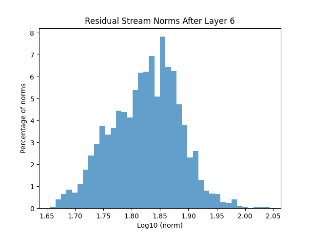

## Norm of activation vectors after layer 6 in the residual stream of GPT-2 small 

### Histogram of norms over samples & tokens.

  

### Summary Stats

Average norm = 67.352  
Standard deviation of the norms = 9.354
